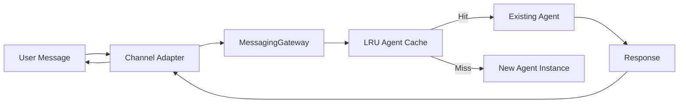
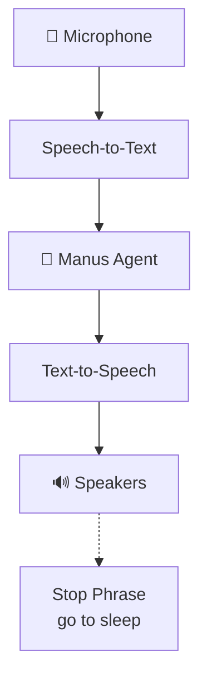
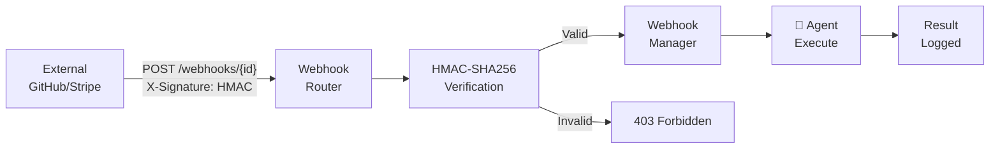
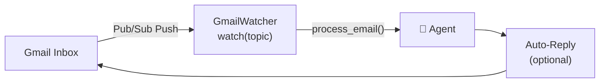
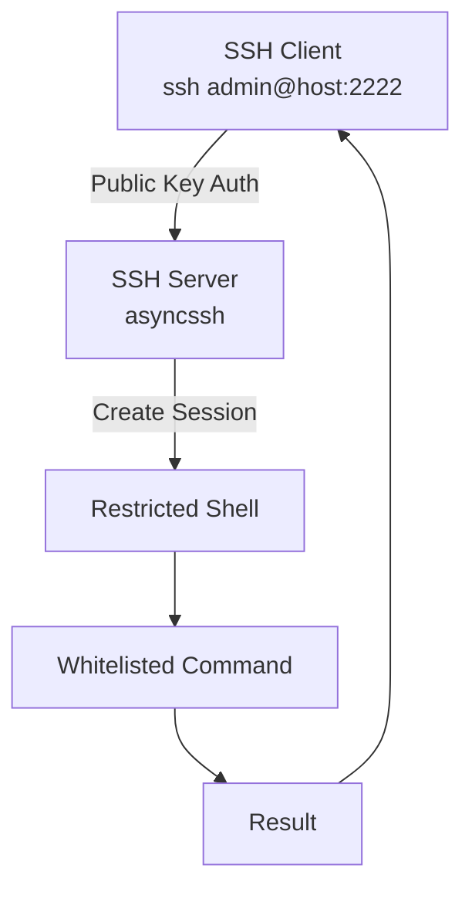
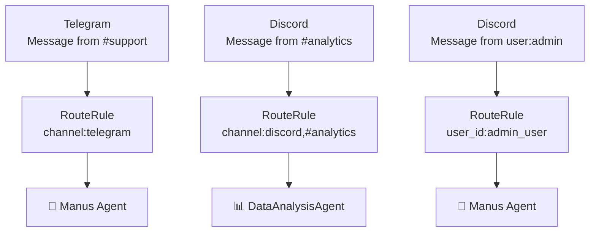
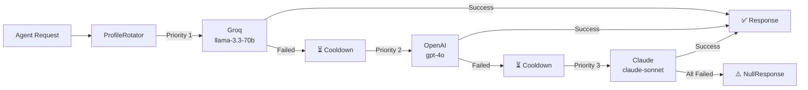
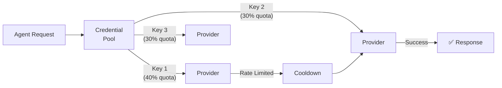

# ManusClaw v5.0.0 — Feature Showcase & Usage Guide

> Complete guide for all new features added in ManusClaw v5.0.0. Each section includes configuration, commands, and real-world usage examples.

---

## 📑 Table of Contents

- [1. 📨 12+ Messaging Channels](#1-12-messaging-channels)
- [2. 🎤 Voice Wake & Talk Mode](#2-voice-wake--talk-mode)
- [3. 🎨 Live Canvas (A2UI)](#3-live-canvas-a2ui)
- [4. 🪝 Webhooks (Incoming)](#4-webhooks-incoming)
- [5. 📧 Gmail Pub/Sub Automation](#5-gmail-pubsub-automation)
- [6. 🔑 SSH Remote Gateway](#6-ssh-remote-gateway)
- [7. 🔀 Multi-Agent Routing](#7-multi-agent-routing)
- [8. 🔄 Model Failover Profiles](#8-model-failover-profiles)
- [9. 🖥️ Companion Apps](#9-companion-apps)
- [10. 🧩 Session Tools CLI](#10-session-tools-cli)
- [11. 🐛 Sandbox Backends](#11-sandbox-backends)
- [12. ⏰ Enhanced Cron](#12-enhanced-cron)
- [13. 🌐 10+ LLM Providers](#13-10-llm-providers)
- [14. 🔑 Credential Pool](#14-credential-pool)

---

## 1. 📨 12+ Messaging Channels

### Architecture Overview

All messaging adapters inherit from `BaseMessagingAdapter` (in `app/messaging/base.py`). The `MessagingGateway` maintains an LRU agent cache (128 slots, 5-minute TTL) per conversation thread, so each user gets a persistent agent.



### Channel Status Matrix

| # | Channel | File | Protocol | Status | Requirements |
|---|---|---|---|---|---|
| 1 | **Telegram** | `telegram.py` | Bot API | ✅ Full | `TELEGRAM_BOT_TOKEN` |
| 2 | **Discord** | `discord.py` | Gateway | ✅ Full | `DISCORD_BOT_TOKEN` |
| 3 | **Slack** | `slack.py` | Web API | ✅ Full | `SLACK_BOT_TOKEN` |
| 4 | **WhatsApp** | `whatsapp.py` | Business Cloud | ✅ Full | `WHATSAPP_ACCESS_TOKEN`, `WHATSAPP_BUSINESS_PHONE_ID` |
| 5 | **Signal** | `signal.py` | REST API | ✅ Full | `SIGNAL_CLI_REST_URL`, `SIGNAL_CLI_NUMBER` |
| 6 | **Microsoft Teams** | `teams.py` | Bot Framework | 🔧 Stub | `MICROSOFT_APP_ID`, `MICROSOFT_APP_PASSWORD` |
| 7 | **Matrix** | `matrix.py` | Homeserver REST | ✅ Full | `MATRIX_HOMESERVER`, `MATRIX_ACCESS_TOKEN`, `MATRIX_USER_ID` |
| 8 | **IRC** | `irc.py` | Raw TCP | ✅ Full | `IRC_SERVER`, `IRC_PORT`, `IRC_NICK`, `IRC_CHANNELS` |
| 9 | **Twitch** | `twitch.py` | IRC-over-TLS | ✅ Full | `TWITCH_BOT_TOKEN`, `TWITCH_CHANNEL` |
| 10 | **WebChat** | `webchat.py` | WebSocket | ✅ Full | None — built-in |
| 11 | **Email** | `email.py` | SMTP | 🔧 Stub | `EMAIL_SMTP_HOST`, `EMAIL_USER`, `EMAIL_PASS` |
| 12 | **Google Chat** | `google_chat.py` | Chat API v1 | 🔧 Stub | `GOOGLE_CHAT_SERVICE_ACCOUNT` |

### 1.1 WhatsApp Setup

WhatsApp uses the Meta Business Cloud API. The adapter receives messages via webhook verification and sends responses via the Cloud API.

**Step 1: Get Meta Developer credentials**
- Go to https://developers.facebook.com/
- Create a Meta App
- Under "WhatsApp" → "API Setup" → add a phone number
- Generate a Permanent Access Token
- Copy your Business Phone ID

**Step 2: Configure environment**
```bash
export WHATSAPP_ACCESS_TOKEN="EAAxxxxxxxxxxxxxxxxxxxxxxxxxxxxxxxxxxxxxxxxxxxxxxxxxxxxxxxx"
export WHATSAPP_BUSINESS_PHONE_ID="1234567890"
```

**Step 3: Start the channel**
```bash
manusclaw-channels start whatsapp
```

**How it works:**
- The adapter registers a webhook verification endpoint
- When a message arrives, it parses the WhatsApp event payload
- The message is routed through the MessagingGateway to a Manus agent
- The agent's response is sent back via the WhatsApp Cloud API (`POST /v18.0/{phone_id}/messages`)

### 1.2 Signal Setup

Signal uses `signal-cli` running as a REST API server. The adapter polls for new messages and sends via the REST API.

**Step 1: Install and start signal-cli**
```bash
# Install signal-cli (varies by OS)
pip install signal-cli
# OR use the pre-built Docker image
docker run --rm -it -v ~/.local/share/signal-cli:/root/.local/share/signal-cli \
  kbuid/signal-cli:latest

# Start REST API server
signal-cli -u +1234567890 daemon --socket /tmp/signal.sock &
```

**Step 2: Configure**
```bash
export SIGNAL_CLI_REST_URL=http://localhost:8080
export SIGNAL_CLI_NUMBER=+1234567890
```

**Step 3: Start**
```bash
manusclaw-channels start signal
```

### 1.3 Matrix Setup

Matrix uses the Homeserver REST API with long-polling (`/sync` endpoint). The adapter ignores its own events to prevent loops.

**Step 1: Create a Matrix account/bot**
- Register on your Matrix homeserver or matrix.org
- Create an access token
- Get your user ID

**Step 2: Configure**
```bash
export MATRIX_HOMESERVER=https://matrix.org
export MATRIX_ACCESS_TOKEN=syt_your_token_here
export MATRIX_USER_ID=@manusclaw:matrix.org
```

**Step 3: Start**
```bash
manusclaw-channels start matrix
```

### 1.4 IRC Setup

IRC is a pure async TCP client — no external dependencies required. It handles PING keepalive, message splitting (512-byte chunks), and channel joining.

```bash
export IRC_SERVER=irc.libera.chat
export IRC_PORT=6697
export IRC_NICK=manusclaw-bot
export IRC_CHANNELS="#manusclaw,#ai-agents"
manusclaw-channels start irc
```

### 1.5 Twitch Chat Setup

Twitch uses IRC-over-TLS (`irc.chat.twitch.tv:4443`) with OAuth authentication and CAP REQ tags.

```bash
export TWITCH_BOT_TOKEN=oauth:your_oauth_token
export TWITCH_CHANNEL=your_channel_name
manusclaw-channels start twitch
```

> **Note**: Twitch rate limits to 20 messages per 30 seconds. The adapter handles this automatically.

### 1.6 WebChat (Built-in)

WebChat requires NO external credentials. It's always available when the HTTP server is running.

```bash
manusclaw-server
# Connect to ws://localhost:8765/ws/{session_id}
```

The WebChatAdapter maintains per-client async queues for isolated message streams.

---

## 2. 🎤 Voice Wake & Talk Mode

### Architecture



### 2.1 Wake Word Detection

Three backends with automatic fallback:

| Backend | Priority | Requirements | Latency |
|---|---|---|---|
| **Porcupine** | 1st | `PICOVOICE_API_KEY`, pyaudio | ~50ms |
| **Google STT** | 2nd | `speech_recognition` package | ~2s |
| **Stub** | 3rd | None | 30s simulation |

**With Porcupine (recommended):**
```bash
export PICOVOICE_API_KEY=your-key
manusclaw voice wake --start --word "hey manus" --sensitivity 0.7
```

**Without Porcupine (falls back to Google STT):**
```bash
manusclaw voice wake --start --word "hey manus"
```

**Custom wake words:** Any phrase works with Porcupine. With Google STT, it uses substring matching against audio transcripts.

### 2.2 Talk Mode

Continuous voice conversation: microphone -> STT -> agent -> TTS -> speakers.

**STT Engines:**

| Engine | Requirements | Quality |
|---|---|---|
| **Google Web Speech** | Internet connection | Good |
| **OpenAI Whisper** | `whisper` package, ~1GB model | Excellent |
| **Stub** | None | Input via stdin |

**TTS Providers (auto-selected):**

| Provider | Quality | Key | Network |
|---|---|---|---|
| **ElevenLabs** | ⭐⭐⭐⭐⭐ | `ELEVENLABS_API_KEY` | Required |
| **OpenAI** | ⭐⭐⭐⭐ | `OPENAI_API_KEY` | Required |
| **System (pyttsx3)** | ⭐⭐⭐ | Auto-detected | Offline |
| **Null** | — | Fallback | — |

**Usage:**
```bash
# Best experience: Groq for LLM + ElevenLabs for TTS
export GROQ_API_KEY=your-key
export ELEVENLABS_API_KEY=your-key
manusclaw voice talk --start
```

**Stop phrases:** "stop listening", "go to sleep", "goodbye"

---

## 3. 🎨 Live Canvas (A2UI)

### What is A2UI?

The Agent-to-UI (A2UI) protocol allows agents to render interactive UI components in real-time through WebSocket connections. Components include:

| Component | Type | Description |
|---|---|---|
| `TextComponent` | Text | Rich text with markdown |
| `ImageComponent` | Image | Base64 or URL images |
| `ButtonComponent` | Button | Clickable with callbacks |
| `TableComponent` | Table | Headers + rows |
| `ChartComponent` | Chart | Bar, line, pie, scatter, radar |
| `ContainerComponent` | Layout | Row, column, grid |

### Starting the Canvas

```bash
manusclaw-server
# Canvas WebSocket: ws://localhost:8765/ws/canvas/{session_id}
```

### How Agents Use It

When the agent calls the CanvasTool during execution:

```python
# Agent tool call to render a chart
await canvas_tool.execute({
    "action": "add_chart",
    "chart_type": "bar",
    "title": "Sales Report",
    "datasets": [
        {"label": "Q1", "data": [120, 190, 300, 250]},
        {"label": "Q2", "data": [200, 180, 220, 310]}
    ]
})
```

### Mobile Canvas Nodes

The DeviceManager (`app/nodes/manager.py`) enables mobile/desktop clients to connect as rendering nodes:

```bash
manusclaw-node --server ws://your-server:8765
```

---

## 4. 🪝 Webhooks (Incoming)

### HMAC Verification Flow



### Creating a Webhook

```bash
# Create webhook for GitHub push events
manusclaw-webhook create \
  --url "/webhooks/github-push" \
  --secret "my-webhook-secret" \
  --prompt "Analyze this GitHub push and summarize the changes: {{payload.head_commit.message}} Author: {{payload.head_commit.author.name}}"

# List all webhooks
manusclaw-webhook list

# Delete a webhook
manusclaw-webhook delete --id github-push

# Get HMAC signature for testing
manusclaw-webhook sign --id github-push \
  --payload '{"head_commit": {"message": "test commit"}}'
```

### Template Variables

The `{{payload.field}}` syntax interpolates webhook payload data into the agent prompt:

```json
{
  "head_commit": {
    "message": "Fix authentication bug",
    "author": {"name": "John"}
  }
}
```

Prompt template: `"Analyze push: {{payload.head_commit.message}} by {{payload.head_commit.author.name}}"`

---

## 5. 📧 Gmail Pub/Sub Automation

### How It Works



### Setup

**Step 1: Create Google Cloud service account**
```bash
# Download credentials JSON
export GOOGLE_APPLICATION_CREDENTIALS=/path/to/service-account.json
```

**Step 2: Create Pub/Sub topic**
```bash
gcloud pubsub topics create projects/manusclaw-gmail-topic
gcloud pubsub subscriptions create manusclaw-gmail-sub \
  --topic manusclaw-gmail-topic \
  --push-endpoint https://your-server:8765/webhooks/gmail-push \
  --ack-deadline 600
```

**Step 3: Enable in config**
```bash
export GMAIL_WATCH_TOPIC_NAME=projects/manusclaw-gmail-topic
export GMAIL_AUTO_REPLY=true  # Enable auto-replies
```

---

## 6. 🔑 SSH Remote Gateway

### Architecture



### Setup

```bash
export MANUSCLAW_SSH_ENABLED=true
export MANUSCLAW_SSH_PORT=2222
export MANUSCLAW_SSH_AUTH_KEYS=~/.ssh/authorized_keys

manusclaw-ssh start
```

### Available Commands

| Command | Description |
|---|---|
| `status` | System health check |
| `restart` | Restart the agent |
| `logs` | View recent logs |
| `agent <prompt>` | Send prompt to the running agent |
| `channels list` | Show active messaging channels |
| `cron list` | Show scheduled cron jobs |
| `help` | Show available commands |
| `exit` | Disconnect |

### Security

- **Public key auth only** — no password authentication
- **Command whitelist** — only 9 approved commands
- **Input validation** — rejects pipes, redirects, shell metacharacters
- **Command chaining blocked** — only one command per input

---

## 7. 🔀 Multi-Agent Routing

### How It Works

The `AgentRouter` (`app/agent/router.py`) assigns different agent types to different channels/users based on configurable rules.



### Configuration

```yaml
# ~/.manusclaw/config.yaml
agents:
  definitions:
    - name: manus
      class_path: app.agent.manus.Manus
    - name: data_analyst
      class_path: app.agent.data_analysis.DataAnalysisAgent
    - name: browser_agent
      class_path: app.agent.browser.BrowserAgent

  routes:
    - pattern: "channel:telegram"
      agent: manus
      priority: 1
    - pattern: "channel:discord,#analytics"
      agent: data_analyst
      priority: 2
    - pattern: "user_id:admin_user"
      agent: manus
      priority: 3
```

---

## 8. 🔄 Model Failover Profiles

### How It Works

When the primary LLM provider fails or hits rate limits, ManusClaw automatically switches to the next provider in the failover chain.



### Configuration

```yaml
# ~/.manusclaw/config.yaml
model_profiles:
  default:
    - provider: groq
      model: llama-3.3-70b-versatile
      priority: 1
    - provider: openai
      model: gpt-4o
      priority: 2
    - provider: anthropic
      model: claude-sonnet-4-20250514
      priority: 3
```

### Adaptive Cooldown

- Failed models enter exponential cooldown (starts at 30s, doubles each failure)
- Successful calls immediately reset the cooldown timer
- Per-session profiles allow different routing for different tasks

---

## 9. 🖥️ Companion Apps

### Desktop GUI (Flet)

Cross-platform desktop app with dark theme, chat bubbles, and settings panel.

```bash
pip install flet
manusclaw-desktop
```

### macOS Menu Bar

Native macOS menu bar app using rumps with WebSocket client.

```bash
pip install rumps websockets
manusclaw-menubar
```

### Windows System Tray

Windows system tray app using pystray with WebSocket client.

```bash
pip install pystray Pillow websockets
manusclaw-hub
```

### Mobile Node Client

WebSocket client for iOS/Android/Desktop with canvas rendering, voice forwarding, and screen capture.

```bash
pip install websockets
manusclaw-node --server ws://your-server:8765
```

---

## 10. 🧩 Session Tools CLI

```bash
# List all sessions
manusclaw-sessions list

# Show session history with tool calls
manusclaw-sessions history --session abc123 --tool-calls

# Send a message to a running session
manusclaw-sessions send --session abc123 --message "Continue the task"

# Spawn a new session + agent run
manusclaw-sessions spawn --prompt "Analyze the data"

# Delete a session
manusclaw-sessions delete --session abc123 --force

# Export session as JSON
manusclaw-sessions export --session abc123 --output session.json
```

---

## 11. 🐛 Sandbox Backends

Three sandbox backends for code isolation:

| Backend | File | Use Case | Config |
|---|---|---|---|
| **Docker** | `sandbox/docker.py` | Container isolation (network=none) | `SANDBOX_BACKEND=docker` |
| **SSH** | `sandbox/ssh.py` | Remote execution on dedicated host | `SANDBOX_BACKEND=ssh` |
| **OpenShell** | `sandbox/openshell.py` | Lightweight Linux namespace isolation | `SANDBOX_BACKEND=openshell` |

```yaml
# config.toml
[sandbox]
enabled = true
backend = docker
docker_image = python:3.12-slim
memory_limit = 2g
timeout = 300
```

---

## 12. ⏰ Enhanced Cron

The CronScheduler in v5.0 supports:
- **Channel output delivery** — Send cron job results to messaging channels
- **Webhook triggers** — Trigger cron jobs via incoming webhooks
- **YAML persistence** — Jobs survive server restarts

```yaml
# ~/.manusclaw/cron.yaml
jobs:
  - name: "Daily Report"
    cron: "0 9 * * *"
    prompt: "Generate the daily summary report"
    output:
      channel: telegram
      chat_id: "-1001234567890"
  - name: "Weekly Analysis"
    cron: "0 9 * * 1"
    prompt: "Run the weekly data analysis"
    output:
      webhook: "weekly-analysis"
```

---

## 13. 🌐 10+ LLM Providers

ManusClaw v5.0.0 supports a wide range of LLM providers through a unified adapter layer. Switching providers requires only a config change — no code modifications.

### Supported Providers

| # | Provider | Config Key | Models (Examples) | Notes |
|---|----------|-----------|-------------------|-------|
| 1 | **OpenAI** | `openai` | gpt-4o, gpt-4o-mini, o1-preview | Most popular, best overall |
| 2 | **Anthropic** | `anthropic` | claude-sonnet-4-20250514, claude-opus | Best for long context, coding |
| 3 | **Google** | `google` | gemini-1.5-pro, gemini-1.5-flash | 1M token context window |
| 4 | **Groq** | `groq` | llama-3.3-70b-versatile, mixtral | Ultra-fast inference, free tier |
| 5 | **Mistral** | `mistral` | mistral-large, mistral-medium, codestral | European provider, strong coding |
| 6 | **Ollama** | `ollama` | llama3, codellama, phi3, mistral | Local models, no API needed |
| 7 | **OpenRouter** | `openrouter` | Any model from 100+ providers | Meta-provider, one API key |
| 8 | **HuggingFace** | `huggingface` | Any HF model (GGUF, Transformers) | Free community models |
| 9 | **Together AI** | `together` | Llama, Mistral, StripedHyena | Open-source models, fast |
| 10 | **DeepInfra** | `deepinfra` | Llama, Mixtral, CodeLlama | Competitive pricing |
| 11 | **Cohere** | `cohere` | command-r-plus, command-r | RAG-optimized |
| 12 | **Azure OpenAI** | `azure` | gpt-4o (Azure-hosted) | Enterprise Azure deployment |

### Switching Providers

```bash
# Via command-line flags
manusclaw --provider groq --model llama-3.3-70b-versatile

# Via environment variables
export MANUSCLAW_PROVIDER=anthropic
export MANUSCLAW_MODEL=claude-sonnet-4-20250514

# Via config.toml
cat > ~/.manusclaw/config.toml << 'EOF'
[llm]
provider = "groq"
model = "llama-3.3-70b-versatile"
EOF
```

### Provider-specific Configuration

```toml
[llm]
provider = "openai"
model = "gpt-4o"
temperature = 0.7
max_tokens = 4096

# Provider-specific overrides
[llm.openai]
api_key = ""                    # Uses OPENAI_API_KEY env var if empty
organization = ""               # OpenAI org ID (optional)
base_url = ""                   # Custom endpoint (optional)

[llm.ollama]
base_url = "http://localhost:11434"
model = "llama3"
timeout = 300

[llm.anthropic]
max_tokens = 8192               # Anthropic supports up to 8K output

[llm.google]
max_tokens = 8192

[llm.azure]
deployment_name = "gpt-4o"
api_version = "2024-12-01-preview"
```

---

## 14. 🔑 Credential Pool

The credential pool automatically rotates between multiple API keys to maximize throughput and avoid rate limits. When one key hits its quota, the next key in the pool is used seamlessly.

### How It Works



### Configuration

Keys are defined as numbered environment variables:

```bash
# In ~/.manusclaw/.env or your shell profile
OPENAI_API_KEY_1=sk-proj-key-one
OPENAI_API_KEY_2=sk-proj-key-two
OPENAI_API_KEY_3=sk-proj-key-three

ANTHROPIC_API_KEY_1=sk-ant-key-one
ANTHROPIC_API_KEY_2=sk-ant-key-two
```

The pool automatically detects all numbered keys and rotates between them using a round-robin strategy with automatic cooldown on rate-limited keys.

### Combining with Model Failover

The credential pool works alongside model failover profiles for maximum resilience:

```yaml
# config.yaml — Pool + Failover
model_profiles:
  default:
    - provider: openai       # Uses OPENAI_API_KEY_1, _2, _3 pool
      model: gpt-4o
      priority: 1
    - provider: anthropic   # Uses ANTHROPIC_API_KEY_1, _2 pool
      model: claude-sonnet-4-20250514
      priority: 2
    - provider: groq
      model: llama-3.3-70b-versatile
      priority: 3
```

This setup provides multi-provider failover with per-provider key rotation — the most resilient configuration possible.
